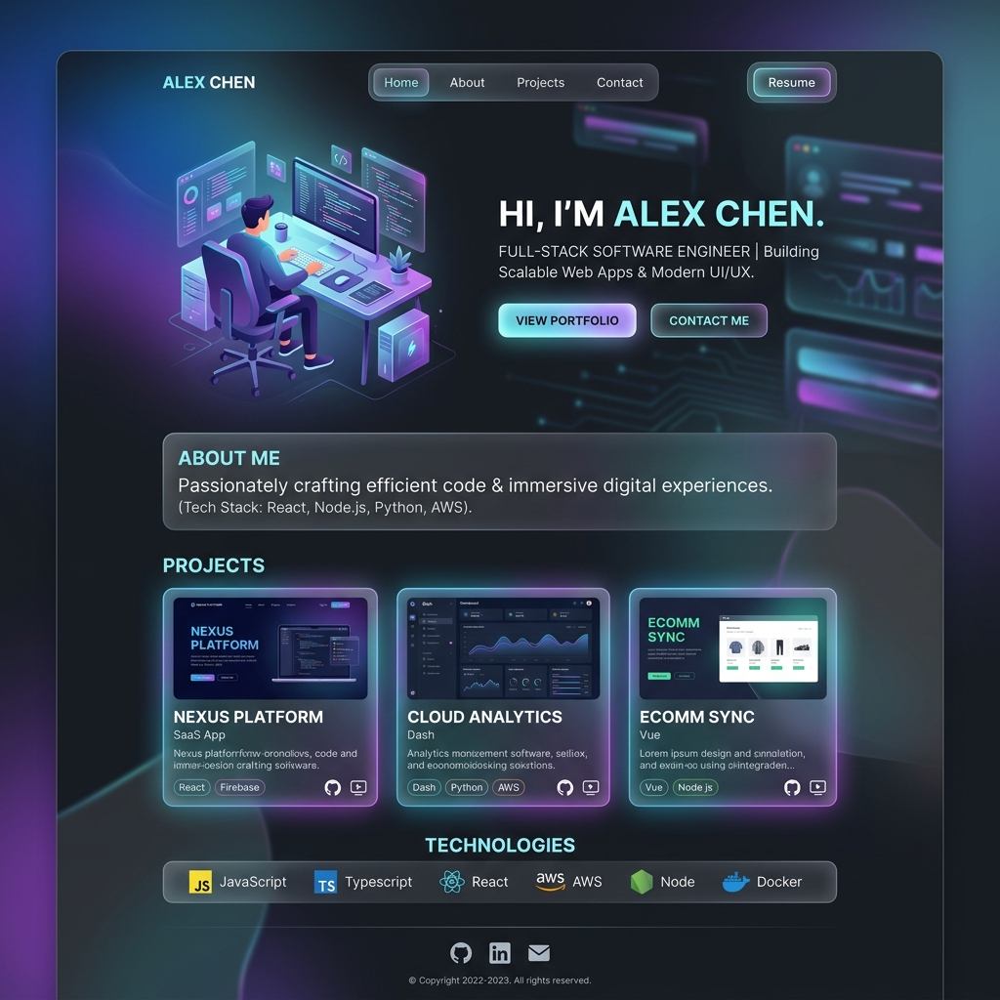
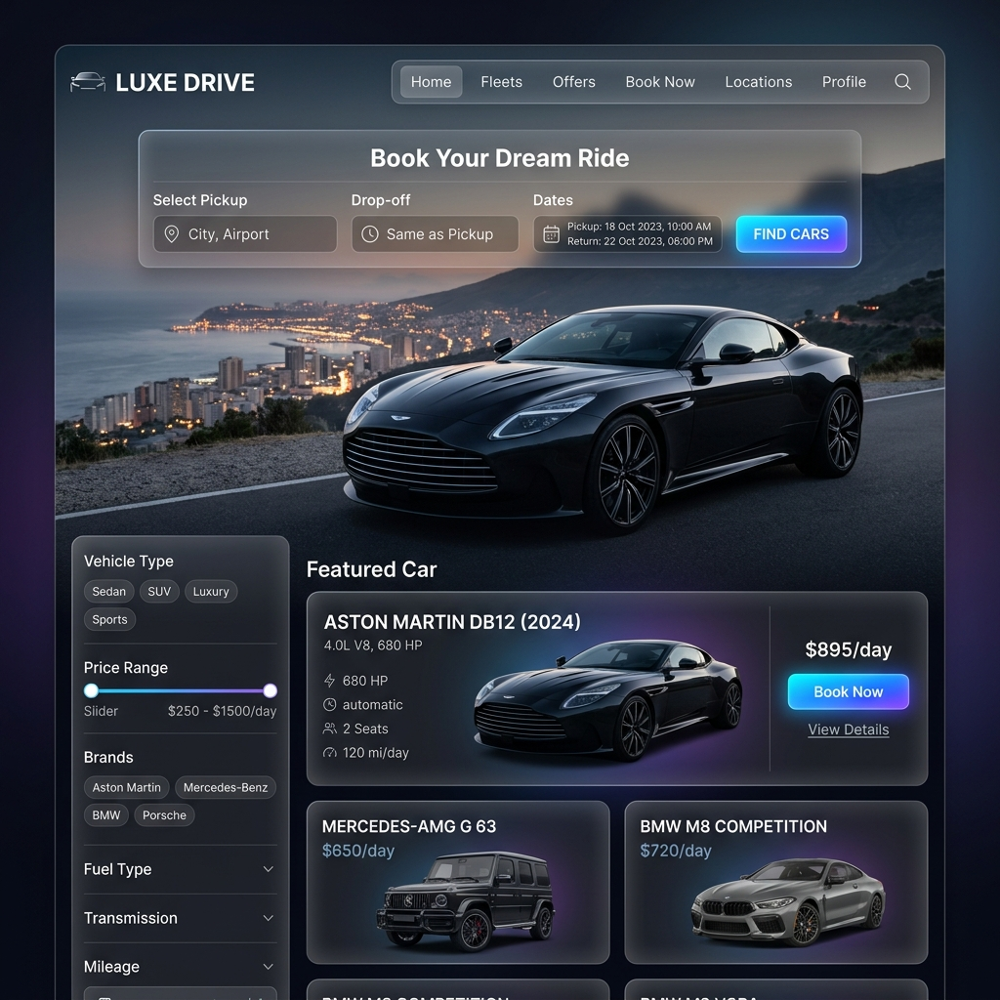
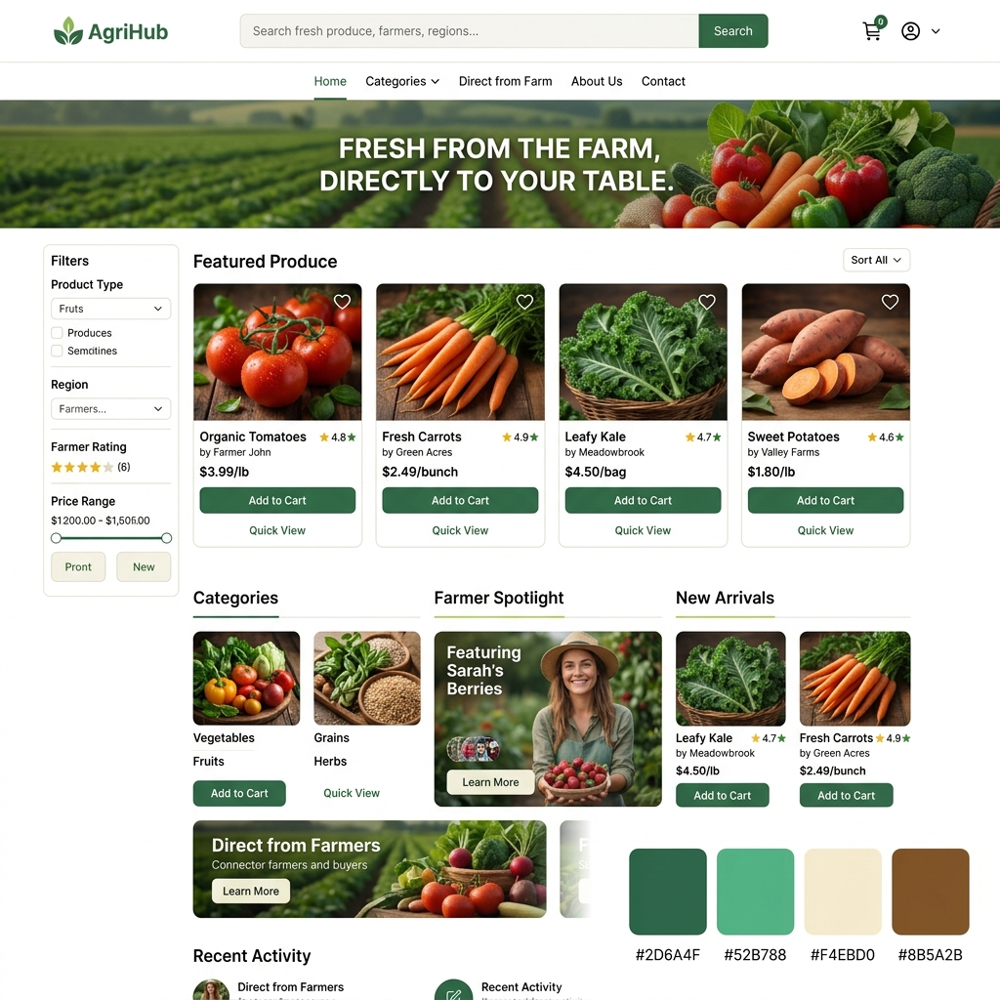
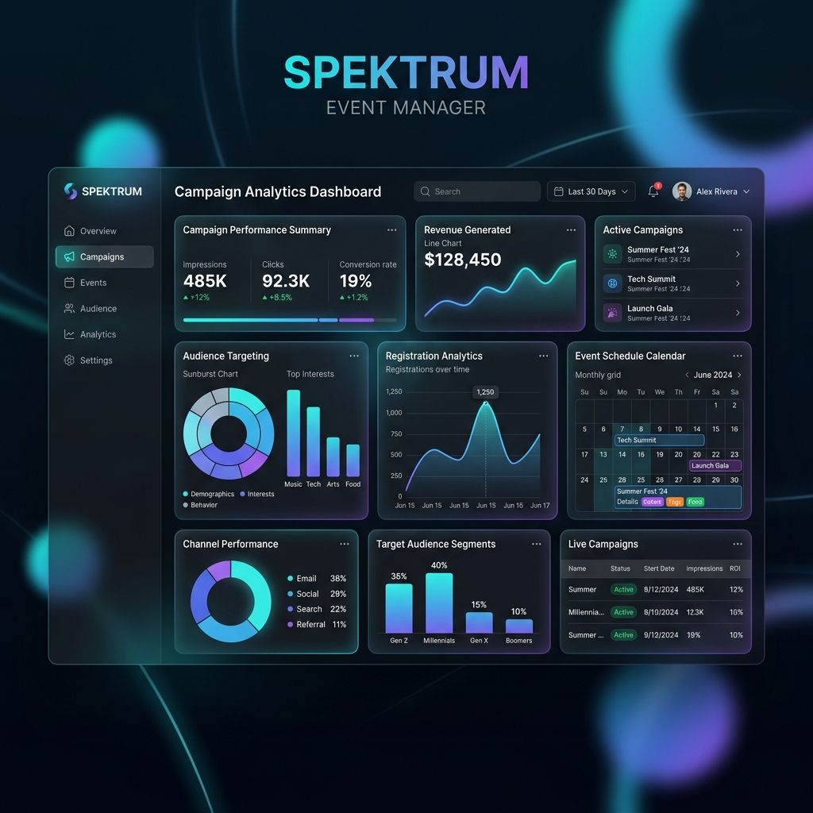
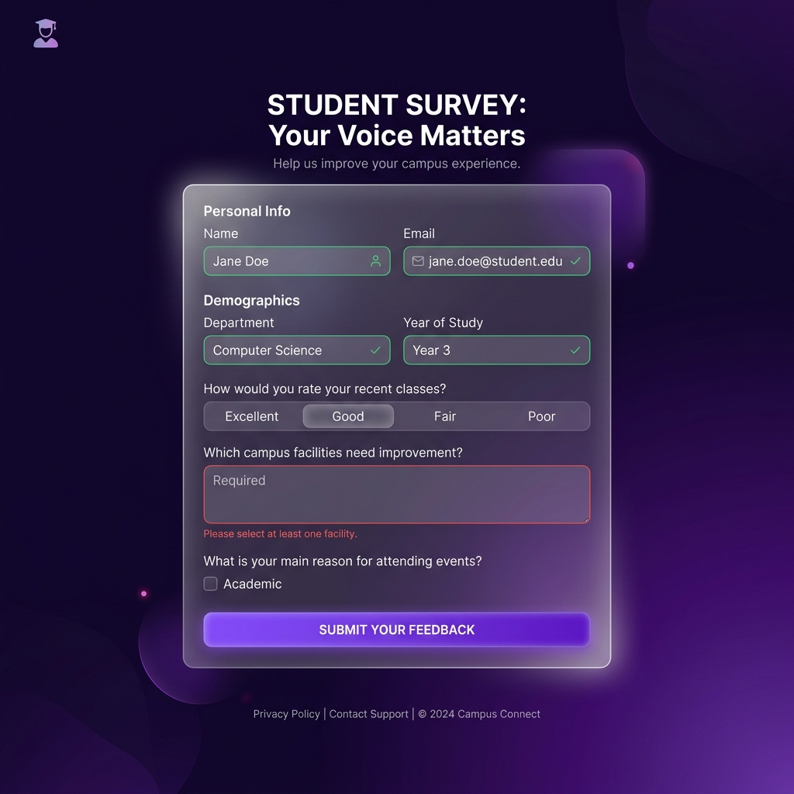

# 🚀 Jeet Nakum - Personal Portfolio



Welcome to my personal portfolio repository! I'm **Jeet Nakum**, a B.Tech Computer Engineering student at Marwadi University (Gujarat, India) and an aspiring **Full Stack Developer**. I love turning ideas into real, working websites.

## 👨‍💻 About Me
I started my coding journey in 2022 and have since built multiple full-stack applications. While I'm currently studying, I believe in learning by doing — building real projects rather than just watching tutorials. I am currently **Open to Work** and looking for my first opportunity in the tech industry.

## 🛠️ My Tech Stack
- **Languages:** JavaScript, HTML5, CSS3, C
- **Frameworks/Backend:** React.js, Node.js, Express.js
- **Databases & Tools:** MongoDB, MySQL, Git/GitHub, VS Code, Figma
- **Certifications:** AWS Cloud Foundations & Data Eng. (AWS Academy), Web Dev Fundamentals (IBM SkillsBuild)

---

## 💻 Featured Projects (With Outputs)

### 1. Personal Portfolio Website

- **Tech Stack:** HTML5, CSS3, JavaScript
- **Features:** Glassmorphism UI, Micro-animations, Fully responsive.

### 2. Car Rental Website

- **Tech Stack:** React.js, Node.js, MongoDB
- **Features:** User authentication, Vehicle booking system, Car listings management.

### 3. Khedut-Market

- **Tech Stack:** React.js, Node.js, MongoDB
- **Features:** Digital marketplace connecting farmers with buyers, Product listings, Order management.

### 4. Event Marketing Platform

- **Tech Stack:** React.js, Node.js, MongoDB
- **Features:** Campaign management, Event scheduling, Online registrations.

### 5. Student Survey Form

- **Tech Stack:** HTML5, CSS3, JavaScript
- **Features:** Form validation, Interactive UI features.

---

## 🚀 How to Run Locally

1. Clone the repository:
   ```bash
   git clone https://github.com/Jeetnakum/Personal-Portfolio.git
   ```
2. Open the project folder and run `index.html` in your browser.

## 📫 Connect with Me
- **LinkedIn**: [jeetnakum](https://www.linkedin.com/in/jeetnakum/)
- **GitHub**: [Jeetnakum](https://github.com/Jeetnakum)
- **Email**: jeetnakum85@gmail.com